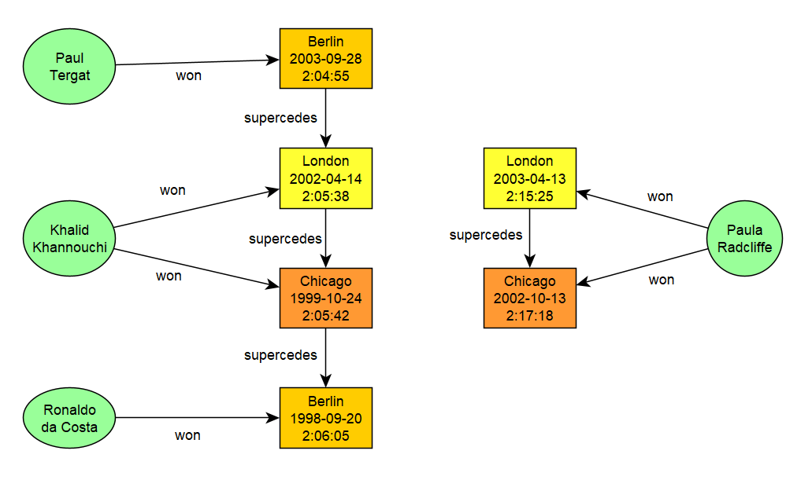
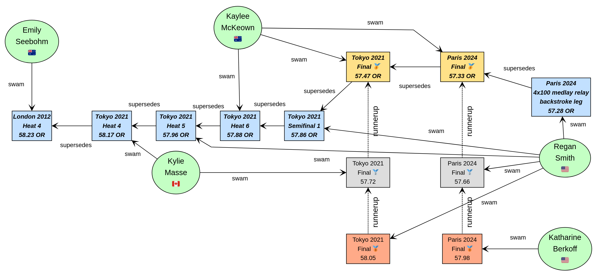

# groovy-graphdb

The athlete example contains Groovy code for manipulating some historic marathon world records:



The swimming example contains Groovy code for manipulating some selected backstroke swimming olympic records:



All scripts can be run as Gradle tasks. To see available tasks use:

```
$ ./gradlew tasks --group=Application
```
