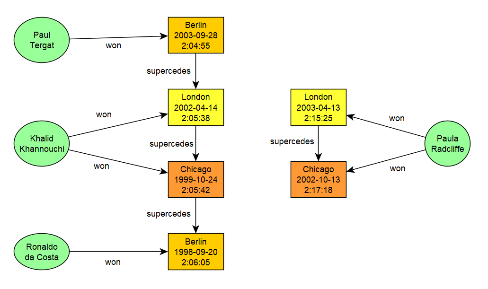
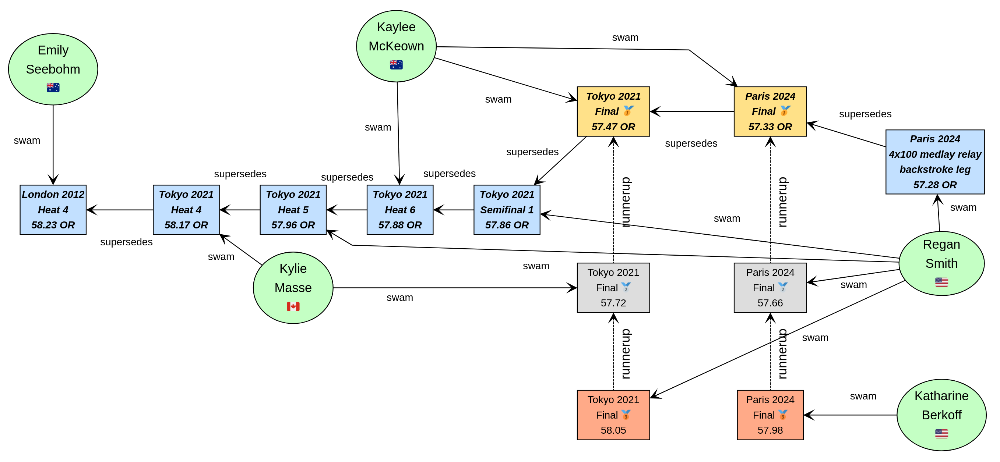

<!--
SPDX-License-Identifier: Apache-2.0

Licensed under the Apache License, Version 2.0 (the "License");
you may not use this file except in compliance with the License.
You may obtain a copy of the License at

    https://www.apache.org/licenses/LICENSE-2.0

Unless required by applicable law or agreed to in writing, software
distributed under the License is distributed on an "AS IS" BASIS,
WITHOUT WARRANTIES OR CONDITIONS OF ANY KIND, either express or implied.
See the License for the specific language governing permissions and
limitations under the License.
-->
# groovy-graphdb

Source code for the following [blog post](https://groovy.apache.org/blog/groovy-graph-databases).

## Marathon Runner Case Study

The athlete example contains Groovy code for manipulating some historic marathon world records:



## Backstroke Swimmer Case Study
The swimming example contains Groovy code for manipulating some selected backstroke swimming Olympic records:



## Instructions and setup

All scripts can be run as Gradle tasks. To see available tasks use:

```bash
$ ./gradlew tasks --group=Application
```

Some scripts require database servers to be already running.
Source files give hints to start such services using docker.

Examine also the respective [GitHub actions](.github/workflows) to see more details of
running services with docker as well as the script output from running all scripts.

As an example, you can run your own _hugegraph_ server, or use the following docker command (as per comment in the related [source file](hugegraph/src/main/groovy/HugeGraphSwimmers.groovy)):

```bash
$ docker run -itd --name=graph -p 8080:8080 hugegraph/hugegraph
```

To confirm what the GitHub actions use, you can confirm the appropriate settings, e.g. in [hugegraphRun.yml](.github/workflows/hugegraphRun.yml):

```yaml
    services:
      hugegraph:
        image: hugegraph/hugegraph:latest
        ports:
          - 8080:8080
```

Likewise, other examples requiring services have similar hints and setup.
